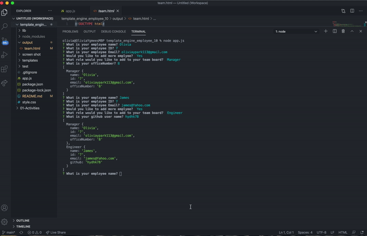

## [Template_engine_employee_10](https://github.com/Oliviapark113/template_engine_employee_10)

 # Table of Contents 

   - [Description](#description)
   - [Installation](#installation)
   - [User Story](#userstory)
   - [Contributing](#contributing)
   - [Test](#test)
   - [Credits](#credits)
   - [Questions](#description)

## Description 

The application will prompt the user for information about the team manager and then information about the team members. The user can input any number of team members, and they may be a mix of engineers and interns. When the user has completed building the team, the application will create an HTML file that displays a nicely formatted team roster based on the information provided by the user.

## Installation 

`npm install`

`npm install jest --save-dev`

`npm i inquirer`

`npm i path`

## User Story 

As a manager
I want to generate a webpage that displays my team's basic info
so that I have quick access to emails and GitHub profiles.

 ## Contributing:

   Triology and North Western Bootcamp provide the starter material including test, html template in both html & JS, css code and material.

 ## Test:
  
  `npm test`

  Pass all test.

  

 ## Credits:

   This is my work besides the starter material and Instructor's advise

 ## Questions:

   For questions about the Generator you can go to my GitHub Page at the following Link:

 - [GitHub Profile](https://github.com/Oliviapark113)

- [View Code](https://github.com/Oliviapark113/template_engine_employee_10)

## Demo Project.

  
